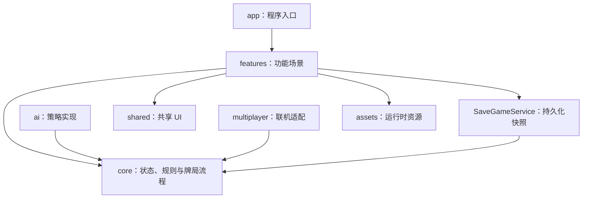

# Bonus 项目架构

## 设计目标

本架构优先保证以下能力：

1. 规则逻辑可以脱离场景树运行和测试。
2. 单机、AI 和多人游戏共用同一套规则与状态转换。
3. 界面只负责显示状态和收集意图，不直接修改牌局数据。
4. 场景可以独立开发，并允许以后增加教程、过渡动画和其他模式。
5. 依赖方向明确，避免通过全局单例连接所有对象。

## 依赖关系



`core/` 不得反向引用 `features/`、`ai/`、`multiplayer/` 或具体美术资源。这样可以在无窗口环境中验证规则，也能让不同玩家控制方式复用同一牌局。

## 目录职责

```text
res://
├── app/                         # 程序入口和顶层组合
├── assets/
│   ├── art/
│   │   ├── cards/               # 实际使用的牌面与牌背
│   │   ├── dice/                # 实际使用的骰子素材
│   │   └── chips/               # 实际使用的筹码素材
│   ├── audio/
│   ├── fonts/
│   └── themes/
├── autoload/                    # 导航、设置、音频等跨场景服务
├── core/
│   ├── model/                   # 卡牌、玩家、牌堆和牌局状态
│   ├── rules/                   # 牌型识别、比较和行动校验
│   ├── session/                 # 牌局状态机及动作处理
│   └── ports/                   # AI、网络和随机源等接口
├── features/
│   ├── main_menu/
│   ├── game/
│   │   ├── presentation/        # 牌桌、卡牌、骰子和玩家席位
│   │   └── ui/                  # HUD、按钮、弹窗和提示
│   ├── settings/
│   ├── tutorial/
│   └── transitions/
├── ai/
│   └── strategies/              # 可替换的 AI 策略
├── localization/                # 翻译源文件与语言资源
├── multiplayer/
│   ├── protocol/                # 可序列化消息和版本定义
│   └── transports/              # ENet、WebSocket 等传输实现
├── shared/
│   └── ui/                      # 跨功能复用的界面组件
├── tests/
│   ├── unit/
│   └── integration/
└── docs/
```

Godot 场景与专属脚本按功能就近存放。例如 `game_scene.tscn` 与 `game_scene.gd` 都放在 `features/game/`。项目不建立彼此分离的全局 `scenes/` 和 `scripts/` 目录，以免一个功能被拆散到多处。

## 核心模型

### CardData

卡牌是纯数据，不是界面节点。至少包含：

- `card_id`：一局内唯一，用于区分两副牌中的同花色同牌面卡牌。
- `rank`：按正式规则定义的牌面顺序。
- `suit`：用于选择美术；不参与大小比较。
- `joker_kind`：普通牌、小王或大王。

界面中的 `CardView` 只保存对应的 `card_id`，显示内容由快照数据决定。

### GameState

`GameState` 是牌局唯一可信状态，包含：

- 摸牌堆、弃牌堆和每位玩家的手牌。
- 玩家顺序、庄家、当前行动者和当前掷骰者。
- 骰子点数、当前桌面牌、最后出牌者和 BONUS 状态。
- 当前阶段、胜者及继续行动所需的信息。

UI、AI 和网络代码均不得绕过牌局流程直接修改这些数据。

### GameAction

所有牌局操作都表示为可序列化动作，例如：

- 开始游戏。
- 掷骰子。
- 打出一组 `card_id`。
- 不出牌。

本地点击、AI 决策和网络消息最终都转换为同一种动作。动作先经过规则校验，再由牌局状态机执行。

## 规则与牌局流程

`core/rules/` 提供无副作用的判定：

- 识别牌型并得到用于比较的主体牌面。
- 判断一组牌是否符合骰子点数或 BONUS 要求。
- 判断跟牌能否盖过当前牌。
- 返回玩家当前可执行的合法动作。

`core/session/` 负责有顺序的状态变化：建立牌堆、洗牌、发牌、推进回合、摸牌、回收弃牌、处理万能牌惩罚以及确认胜者。

牌局流程使用明确阶段，初步划分为：

```text
SETUP -> DEALING -> WAITING_FOR_ROLL -> WAITING_FOR_ACTION -> RESOLVING -> FINISHED
```

阶段转换由 `GameSession` 统一处理。界面动画可以等待事件，但动画结束不能决定规则结果。

## 随机性

洗牌和骰子不直接调用全局随机函数，而通过可注入的随机源生成。正式游戏使用随机种子，测试使用固定种子。玩家提供的种子会先归一化为整数；相同种子生成相同的洗牌和后续骰子序列。存档同时记录 RNG 的 `seed` 与内部 `state`，恢复时先设置种子再恢复状态。多人游戏中只有权威端生成随机结果，并把结果作为状态或事件同步给客户端。

## 场景职责

### App 场景

`app/app.tscn` 是程序主场景，负责装载主菜单或游戏场景、播放场景过渡，并常驻显示版本号；它不保存具体牌局数据。

### 主菜单与设置

- `features/main_menu/` 负责单人规则配置、设置入口和退出。
- `shared/ui/settings_panel.tscn` 是主菜单与游戏内共用的设置控件；主菜单使用侧栏，游戏场景使用带遮罩的模态层。
- 设置持久化由 `SettingsService` 完成。界面先编辑快照，点击“应用”后再一次性校验、保存并应用，取消不会改变当前配置。
- 单局可选规则使用独立 `GameRules` 快照传入 `GameSession`，不会作为全局设置污染下一局。

### 游戏场景

`features/game/game_scene.tscn` 负责组合：

- 单局 `GameSession`。
- 牌桌与玩家席位。
- 骰子、摸牌堆和弃牌区域。
- 本地手牌及鼠标选择。
- 行动按钮、状态提示和结算弹窗。

游戏场景持有当前 `GameSession`；跨场景保存由 `SaveGameService` 接收纯数据快照完成，场景节点本身不会进入存档。

### 存档

- 未完成牌局保存到 `user://bonus_save.json`，不写入项目目录。
- `GameSession` 快照包含所有牌堆、玩家手牌、牌型、阶段、回合计数、规则、种子和 RNG 状态。
- 每次牌局状态变化以及返回主界面时保存；结算后清除存档。
- 主菜单只负责询问继续或新开，快照校验和文件读写由 `SaveGameService` 负责。

## Autoload 原则

只允许真正跨场景且生命周期等同于程序的服务成为 Autoload。预计包括：

- 场景导航。
- 设置存储。
- 音频播放。
- 未完成牌局的单文件持久化。

`GameSession`、牌堆、玩家列表、AI 和网络房间状态默认不使用 Autoload。新增 Autoload 必须在本文档记录理由。

## AI 扩展

AI 策略通过 `core/ports/` 中的玩家代理接口接收与真实牌局分离的公开信息快照，并返回一个 `PlayerDecision`。策略不得访问场景节点、其他玩家手牌或直接修改状态；牌局会统一验证策略返回的动作。

基础随机策略、规则策略或以后接入的外部算法都使用同一接口，因此替换算法不需要修改游戏场景。

策略接口、上下文字段和注册方式见 [AI 策略接口](ai_strategy_api.md)。

## 多人联机扩展

多人模式采用权威端模型：

1. 客户端提交动作意图。
2. 权威端使用同一规则核心校验并执行动作。
3. 权威端广播确认后的事件或状态快照。
4. 客户端只根据确认结果更新显示。

`multiplayer/protocol/` 只定义可序列化数据，不包含具体网络 API；`multiplayer/transports/` 负责 Godot MultiplayerAPI、ENet 或其他传输方式。协议必须带版本号，状态中只传稳定 ID 和基础类型，不传节点引用。

## 编码规范

- 遵循 Godot GDScript 风格指南和 `.editorconfig`。
- GDScript 使用 Tab 缩进和静态类型。
- 文件名、函数名和变量名使用 `snake_case`。
- 类名、节点名和枚举名使用 `PascalCase`，枚举成员使用 `CONSTANT_CASE`。
- 信号描述已经发生的事件，并使用过去时。
- 单个类只承担一个清晰职责；避免新增泛化的 `manager` 或 `utils` 容器。
- 通过构造参数、初始化方法或明确端口提供依赖，不在核心逻辑中查找场景节点或读取 Autoload。
- 对规则和状态转换优先编写单元测试；场景测试只验证组合与交互。

## 美术资源策略

提供的 `Card_Game_GFX` 是扑克牌、骰子和筹码的唯一美术来源。实现具体界面时先选择所需样式，再复制到对应的 `assets/art/` 子目录，并保持统一命名。未使用的替代样式不进入项目仓库。

资源映射集中处理，规则模型不保存纹理路径。例如，`CardTextureCatalog` 根据花色和牌面返回纹理，`CardData` 本身不依赖任何美术资源。

## 测试边界

- `tests/unit/`：牌堆数量、洗牌可复现性、发牌、牌型、比较、合法动作和状态转换。
- `tests/integration/`：从开始游戏到产生胜者的完整牌局、AI 接入、主菜单转场和设置交互。
- `tests/visual/`：通过真实渲染器导出常用分辨率截图，检查布局、特效和遮挡。
- 场景冒烟测试：节点引用、鼠标交互、不同窗口尺寸和结算流程。

任何规则缺陷都应先在核心测试中复现，再修改实现。
